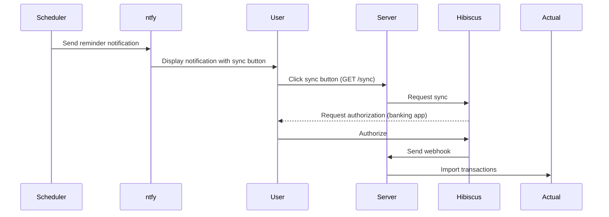

# Hibiscus-Actual Integration

A Node.js application that syncs transactions from Hibiscus Server (a banking interface) to Actual Budget. This integration allows for seamless transaction importing from your bank account to your Actual Budget instance.

Hibiscus Server does the heavy lifting and fetches the transactions from the bank(s) via FinTS / HBCI. When an account is synced in Hibiscus, it notifies this application via a webhook, which then imports the new transactions into Actual Budget.

## Features

- 🔄 Webhook-based transaction syncing from Hibiscus to Actual Budget
- 🎯 Smart transaction mapping with detailed notes
- 💡 Intelligent duplicate detection
- 📦 Support for multiple budgets and accounts
- 🚀 Real-time updates when accounts are synced in Hibiscus

## Prerequisites

- Node.js installed on your system
- A Hibiscus instance with accounts set up
- An Actual Budget instance
- A topic on ntfy.sh for notifications

## Notification System

This application uses ntfy.sh to send periodic reminders for triggering the sync from your bank into Hibiscus. Since banks require user interaction for authorization (PushTAN), the sync cannot be fully automated. Instead, you'll receive a notification with a button to trigger the sync.

### How it works



## Installation

1. Clone this repository
2. Install dependencies:
   ```bash
   npm install
   ```
3. Copy the example configuration file:
   ```bash
   cp config/config.json.example config/config.json
   ```
4. Configure your settings in `config/config.json`

### Docker Installation

When running with Docker, you'll need to mount both the data and config volumes:

```bash
docker run -v /path/to/config:/app/config -v /path/to/data:/app/data -p 3000:3000 hibiscus-actual
```

## Configuration

- `server`: Server settings
  - `publicUrl`: Public URL of your server (required for ntfy button)
- `ntfy`: Notification settings
  - `topic`: Your ntfy.sh topic for notifications
  - `schedule`: Cron schedule for reminders (e.g. "0 12 _/2 _ \*" for noon every 2 days)
- `actual`: Global Actual Budget settings
  - `serverUrl`: Your Actual Budget server URL
  - `password`: Your Actual Budget password
- `hibiscus`: Global Hibiscus settings
  - `url`: Base URL of your Hibiscus server
  - `username`: Your Hibiscus username
  - `password`: Your Hibiscus password
- `dataDir`: Directory for storing Actual Budget data
- `budgets`: Array of budgets to sync
  - `syncId`: The Actual Budget sync ID
  - `accounts`: Array of account mappings
    - `accountId`: The Actual Budget account ID
    - `hibiscusAccountId`: The Hibiscus account ID

## Usage

The server listens on port 3000 by default. You can override this using the `PORT` environment variable.

### Running Locally

Start the server:

```bash
npm start
```

### Running with Docker

```bash
docker run -v /path/to/config:/app/config -v /path/to/data:/app/data -p 3000:3000 -e PORT=3000 hibiscus-actual
```

### Setting Up Hibiscus

Configure Hibiscus to send webhook notifications to this application when accounts are synced:

- In Hibiscus, set up a webhook for account synchronization
- Point it to `http://your-server:3000/webhook`
  When an account is synced in Hibiscus, the server will:

3. Receive the webhook notification
4. Find the corresponding budget and account configuration
5. Download the budget data
6. Fetch and import new transactions for that account
7. Provide a summary of imported transactions
