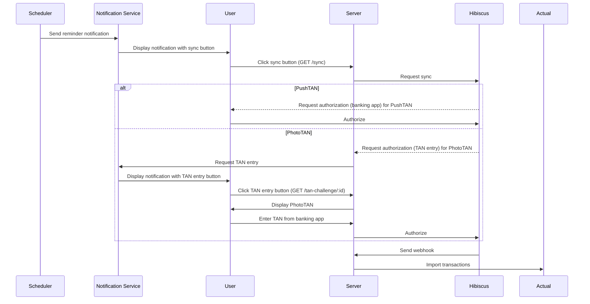

# Hibiscus-Actual Integration

A Node.js application that syncs your bank transactions to Actual Budget using Hibiscus Server as a FinTS/HBCI gateway.

## Features

- 🔄 Webhook-based transaction syncing from Hibiscus to Actual Budget
- 🎯 Transaction mapping with detailed notes
- 💡 Duplicate detection
- 📦 Support for multiple budgets and accounts
- 📱 Notifications via ntfy.sh or Telegram for sync reminders

## How it Works

Hibiscus Server implements the FinTS protocol, handling the banking communication and providing this application with a JSON endpoint for fetching transactions. Authorization with the bank usually requires user interaction (e.g. PushTAN). Because of this, the syncing process cannot be fully automatic. This application will send periodic reminders via ntfy.sh or a Telegram bot with a button triggering the sync. You can keep the notification and trigger the sync when it's convenient to confirm the authorisation prompts.



## Prerequisites

- Node.js
- Hibiscus Server instance with accounts configured
- Actual Budget instance
- ntfy.sh topic for notifications **OR** Telegram Bot

## Installation

### Standard Installation

1. Clone this repository
2. Install dependencies: `npm install`
3. Copy configuration: `cp config/config.json.example config/config.json`
4. Configure `config/config.json`
5. Start server: `npm start`

### Docker Installation

```bash
docker run -v /path/to/config:/app/config \
          -v /path/to/data:/app/data \
          -p 3000:3000 \
          -e PORT=3000 \
          -e PUID=1000 \
          -e PGID=1000 \
          ghcr.io/similicious/hibiscus-actual-budget:latest
```

## Configuration

Configure the following in `config/config.json`:

- `server`: Server settings
  - `publicUrl`: Public URL of your server (required for ntfy button)
- `notificationSchedule`: Cron schedule for reminders (e.g. "0 12 _/2 _ \*" for noon every 2 days)
- `ntfy`: ntfy.sh settings
  - `topic`: Your ntfy.sh topic for notifications
- `telegram`: Telegram settings
  - `token`: Your bot's token
  - `chatId`: The chat to use for notifications
- `actual`: Global Actual Budget settings
  - `serverUrl`: Your Actual Budget server URL
  - `password`: Your Actual Budget password
- `hibiscus`: Global Hibiscus settings
  - `url`: Base URL of your Hibiscus server
  - `username`: Your Hibiscus username
  - `password`: Your Hibiscus password
- `dataDir`: Directory for storing Actual Budget data
- `budgets`: Array of budgets to sync
  - `syncId`: The Actual Budget sync ID
  - `accounts`: Array of account mappings
    - `accountId`: The Actual Budget account ID
    - `hibiscusAccountId`: The Hibiscus account ID

## Telegram Setup

If you want to use Telegram instead of ntfy.sh, you first need to create a bot (by sending `/newbot` to [@BotFather](https://t.me/BotFather)). Specify the `token` in the config, and omit the `chatId` for now. After starting the server, the Telegram bot should be running. If you go to your Bot in Telegram and click the *START* button, or send it any message, it will respond with the Chat ID. Stop the Server, specify the `chatId` in the config, and restart it.

## Hibiscus Setup

1. In Hibiscus, configure a webhook for account synchronization (under *System-Einstellungen* -> *Benachrichtigungen* -> *URL nach erfolgreicher Synchronisierung aufrufen*)
2. Point it to `http://your-server:3000/webhook`

If your bank uses PhotoTAN/QRTAN for HIBC authentication, you will also need to configure the bank connection:

1. Set the TAN-Handler to *XML-RPC Handler*
2. Set the URL to `http://your-server:3000/xmlrpc`
3. Leave the rest as defaults

When an account syncs, the server will automatically:

1. Process the webhook notification
2. Match the budget and account configuration
3. Download budget data
4. Import new transactions
5. Provide an import summary
